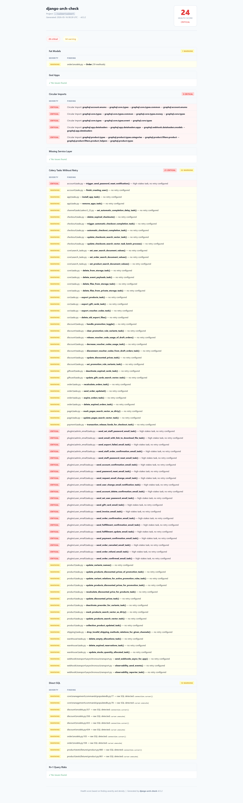

# django-arch-check


[](https://github.com/sponsors/RJ-Gamer)

A command-line architectural health checker for Django projects.

It scans source code statically and flags structural issues before they become entrenched technical debt:

- Fat models
- God apps
- Circular imports
- Missing service layer boundaries
- Celery tasks without retry
- Direct SQL usage
- N+1 query risks

```text
Analyzing: /home/user/myproject

── Fat Models ──────────────────────────────
  [CRITICAL]  core/models.py → UserProfile (34 methods)

  Found 1 fat model(s).

── God Apps ────────────────────────────────
  [WARNING]   core/ owns 41% of total project code (860 / 2,102 lines)

  Found 1 god app(s).

── Circular Imports ────────────────────────
  No circular imports found.

── Missing Service Layer ────────────────────
  [WARNING]   orders/views.py → create_order() makes direct ORM calls

  Found 1 missing service layer issue(s).

── Celery Tasks Without Retry ──────────────
  [CRITICAL]  payments/tasks.py → send_invoice_email() — high-stakes task, no retry configured

  Found 1 Celery task(s) without retry.
```

---

## Why

Django projects often drift toward the same architectural problems:

- Models absorb business logic until they become hard to reason about
- One app quietly turns into the center of the codebase
- View functions talk directly to the ORM and blur boundaries
- Celery tasks lose work because retries were never configured
- Circular imports pile up as module boundaries erode

These issues are easy to normalize and hard to see in code review. `django-arch-check` makes them visible early, in local development and in CI.

---

## Installation

```bash
pip install django-arch-check
```

Requirements:

- Python 3.11+
- No Django runtime setup required

The tool is static-only: it reads source files, parses ASTs, and never imports your project code.

---

## Quick Start

```bash
# Analyze a project and print findings to the terminal
django-arch-check analyze /path/to/project

# Generate a self-contained HTML report
django-arch-check analyze --format html /path/to/project

# Tune thresholds
django-arch-check analyze \
  --fat-model-threshold 20 \
  --god-app-threshold 40 \
  /path/to/project
```

---

## Ignore Detectors

Use `--ignore` to skip one or more detectors entirely.

```bash
django-arch-check analyze --ignore fat_models /path/to/project
django-arch-check analyze --ignore fat_models --ignore god_apps /path/to/project
```

Valid detector names:

- `fat_models`
- `god_apps`
- `circular_imports`
- `missing_service_layer`
- `celery_tasks`
- `direct_sql`
- `n_plus_one`

If an invalid detector name is passed, the CLI exits with a clear error:

```text
Error: Unknown detector 'fat_modelz'. Valid detectors are: fat_models, god_apps, circular_imports, missing_service_layer, celery_tasks, direct_sql, n_plus_one
```

In HTML reports, skipped detectors are shown as:

```text
⊘ Skipped (--ignore flag)
```

---

## Ignore Paths

Use `--ignore-path` to skip files whose relative path contains a given substring.

```bash
django-arch-check analyze --ignore-path legacy/ /path/to/project
django-arch-check analyze --ignore-path legacy/ --ignore-path archive/ /path/to/project
```

This is applied across all detectors. If a file path contains the ignored string, that file is not analyzed.

Examples:

- `--ignore-path legacy/` skips files under paths like `legacy/models.py`
- `--ignore-path archive/` skips files under paths like `apps/orders/archive/tasks.py`

Path ignores are substring-based, not glob-based.

---

## CLI Options

Current `django-arch-check analyze --help` output:

```text
Usage: main analyze [OPTIONS] PROJECT_PATH

  Analyze a Django project at PROJECT_PATH for architectural issues.

Options:
  --fat-model-threshold N  Flag models with >= N non-dunder methods.  [default:
                           15]
  --god-app-threshold PCT  Flag apps owning >= PCT% of total project LOC.
                           [default: 30]
  --ignore DETECTOR        Ignore a detector by name. Repeatable.
  --ignore-path PATH       Skip files whose path contains PATH. Repeatable.
  --format [text|html]     Output format: text (stdout) or html (arch-
                           report.html).  [default: text]
  --help                   Show this message and exit.
```

### Exit Codes

| Code | Meaning |
|------|---------|
| `0` | No critical findings |
| `1` | At least one critical finding, or a CLI usage error |

This makes the tool suitable for CI gating.

---

## Detectors

### Fat Models

Flags Django model classes with too many non-dunder methods.

- Warning: `method_count >= threshold`
- Critical: `method_count >= threshold * 2`
- Default threshold: `15`
- Default critical boundary: `30`

Notes:

- Counts `def` and `async def`
- Ignores dunder methods like `__str__`
- Scans Python files across the project

### God Apps

Flags Django apps that own too much of the total project LOC.

- Warning: `percentage >= threshold`
- Critical: `percentage >= threshold + 20`
- Default threshold: `30%`
- Default critical boundary: `50%`

Notes:

- LOC excludes blank lines and standalone comment lines
- Requires at least 2 Django apps before it reports findings
- Uses `models.py` or `apps.py` to identify app directories

### Circular Imports

Flags cycles in the intra-project import graph.

- Critical: any detected cycle

Notes:

- Only top-level imports are analyzed
- Function-level imports are intentionally ignored
- Reports both short and multi-node cycles

### Missing Service Layer

Flags views that contain too many direct ORM calls and likely need service-layer extraction.

- Warning: 2 or more direct `Model.objects.*` calls in a single view function or method
- Critical: 4 or more direct `Model.objects.*` calls in a single view function or method

Notes:

- Scans `views.py` files only
- Supports function-based views and class-based view methods
- Uses ORM call count, not raw line count

### Celery Tasks Without Retry

Flags Celery tasks that lack retry configuration.

- Critical: task name contains `payment`, `email`, `invoice`, or `notification`, and has no retry config
- Warning: any other task with no retry config

Retry config is considered present when the decorator includes any of:

- `max_retries`
- `autoretry_for`
- `retry_backoff`

Notes:

- Detects both `@shared_task` and `@app.task`
- Skips migration files

### Direct SQL

Flags raw SQL patterns that bypass Django's ORM.

Detected patterns:

- `cursor.execute(`
- `connection.cursor()`
- `.raw(`
- `.extra(select=`

Severity:

- Warning only

Notes:

- Migration files are excluded

### N+1 Query Risks

Flags likely N+1 query patterns inside loops and list comprehensions.

- Warning: ORM call inside a loop or list comprehension, with no `select_related` or `prefetch_related` found in the same function scope

Notes:

- Scans `views.py` and `serializers.py`
- Looks for `X.objects.method(...)` patterns inside loops
- Heuristic by design; false positives and false negatives are possible

---

## HTML Report

```bash
django-arch-check analyze --format html /path/to/project
```



The generated `arch-report.html` is self-contained and works offline.

It includes:

- A health score from `0` to `100`
- Summary counts for critical and warning findings
- One section per detector
- Skipped detector notes when `--ignore` is used

### Health Score

The score is rate-based, not a simple fixed deduction per finding.

Formula:

```text
critical_rate = criticals / total_findings
warning_rate  = warnings  / total_findings
raw           = 100 - (critical_rate * 60) - (warning_rate * 40)
penalty       = min(30, criticals * 2 + warnings * 0.5)
score         = max(0, round(raw - penalty))
```

This avoids driving large mature projects straight to zero while still rewarding lower-severity, lower-density finding profiles.

---

## CI Integration

### GitHub Actions

```yaml
- name: Check Django architecture
  run: |
    pip install django-arch-check
    django-arch-check analyze ./
```

If you want to ignore legacy areas while still gating the rest of the codebase:

```yaml
- name: Check Django architecture
  run: |
    pip install django-arch-check
    django-arch-check analyze --ignore-path legacy/ ./
```

To generate an HTML report artifact:

```yaml
- name: Django architecture report
  run: |
    pip install django-arch-check
    django-arch-check analyze --format html ./

- name: Upload report
  uses: actions/upload-artifact@v4
  with:
    name: arch-report
    path: arch-report.html
```

---

## How It Works

`django-arch-check` analyzes source code statically.

It:

- Walks the project tree
- Skips common non-source directories like `.venv`, `node_modules`, and caches
- Parses Python files with the standard-library `ast` module
- Runs each detector independently through a central analyzer

It does not:

- Import your Django project
- Require configured settings
- Hit the database
- Execute application code

That makes it safe to run in CI, pre-commit hooks, and partially broken repos.

---

## Limitations

- Circular import detection only covers top-level imports
- `--ignore-path` uses substring matching, not glob syntax
- Missing service layer detection only scans files literally named `views.py`
- N+1 detection is heuristic and only reasons within a single function scope
- God app analysis requires at least 2 detectable Django apps

---

## Development

```bash
git clone https://github.com/RJ-Gamer/django-arch-check.git
cd django-arch-check

python -m venv .venv
source .venv/bin/activate   # Windows: .venv\Scripts\activate

pip install -e ".[dev]"

pytest -q --basetemp .pytest-tmp

django-arch-check analyze /path/to/project
```

### Project Structure

```text
django_arch_check/
├── __init__.py
├── cli.py
├── analyzer.py
├── report.py
└── detectors/
    ├── __init__.py
    ├── fat_models.py
    ├── god_apps.py
    ├── circular_imports.py
    ├── missing_service_layer.py
    ├── celery_tasks.py
    ├── direct_sql.py
    └── n_plus_one.py

tests/
├── conftest.py
├── test_analyzer.py
├── test_fat_models.py
├── test_god_apps.py
├── test_circular_imports.py
├── test_missing_service_layer.py
├── test_celery_tasks.py
├── test_direct_sql.py
├── test_n_plus_one.py
├── test_report.py
└── test_cli.py
```

### Adding a New Detector

1. Create `django_arch_check/detectors/my_detector.py`
2. Add a `detect(...)` function that returns finding dataclasses
3. Add the detector to `analyzer.py` and `AnalysisResult`
4. Add text output in `cli.py`
5. Add HTML rendering support in `report.py`
6. Add tests

---

## Contributing

Issues and pull requests are welcome.

If you are proposing a larger detector or behavior change, opening an issue first is appreciated.

---

## Version

The next release version for this change set is `0.4.0`.

---

## License

MIT. See [LICENSE](LICENSE).
